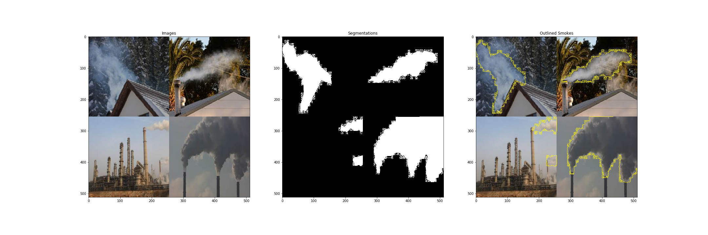
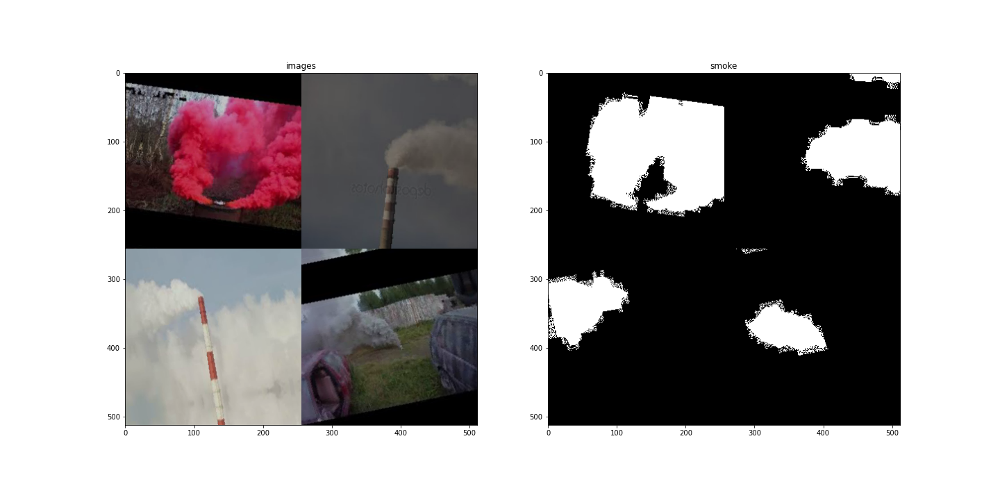
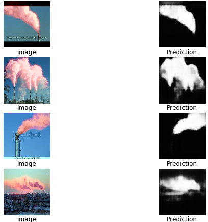

### Smoke detection via semantic segmentation using _[LinkNet](https://arxiv.org/pdf/1707.03718.pdf) model_ and image augmentation in Keras
---

This repo is an implementation from [Kaggle](https://www.kaggle.com/kmader/keras-linknet/)

The main purpose of this use-case is to detect smoke in any background. The smoke can also have variations regarding its source, color, environment etc. We should be able to semantically segment smoke to analyze it's various features like color, intensity, duration of ejection of smoke from source (video feed), etc.

---
### LinkNet
Inspired by auto-encoders, LinkNet is an attempt to get accurate instance level prediction without compromising processing time of the network. In most of the existing techniques for semantic segmentation use encoder-decoder pair as core of their network architecture but here the encoder encodes information into feature space, and the decoder maps this information into spatial categorization to perform segmentation.

Generally, spatial information is lost in the encoder due to pooling or strided convolution is recovered by using the pooling indices or by full convolution. But LinkNet bypasses spatial information, directly from the encoder to the corresponding decoder improves accuracy along with significant decrease in processing time. In this way, information which would have been otherwise lost at each level of encoder is preserved, and no additional parameters and operations are wasted in relearning this lost information.

---
_Architecture_

_Image source: [LinkNet](https://codeac29.github.io/projects/linknet/)_

---

In Kaggle _2018 Data Science Bowl_, [Kevin Mader](https://www.kaggle.com/kmader) has used this model for finding the nuclei in divergent images of size 256x256. However I have used it on 'smoke images' obtained from Google search while resizing them to 256x256. Kevin has used a smaller version of the architecture by using only two encoder-decoder layers, while I have used al four encoder-decoder layers as it resulted in an increase of accuracy in segmenting smoke.

#### Images and corresponding annotations

#### Augmented images and corresponding annotations

#### Results

---

In this repo **LinkNet** has provided more accurate results than **U-Net**, but it would be unfair to comment that **LinkNet** is better than **U-Net**. This is because of the small dataset, and also the U-Net model wasn't implemented in original version.

---

### Scope of improvements
- The dataset has around 400 images, adding more images to dataset can improve the accuracy
- Proper annotation of smoke also affects the prediction of the model, maybe the annotations done in the dataset can be improved and it will surely improve accuracy
